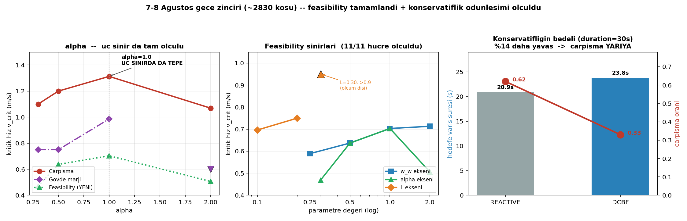

# 7–8 Ağustos Gece Zinciri — Sonuç Raporu

**Süre:** 7 Ağu 00:55 → 7 Ağu 23:17 (22.5 saat, kesintisiz)
**Kapsam:** 9 aşama, ~2830 koşu, **0 hata**, insan müdahalesi yok
**Metrikler:** düzeltilmiş tanımlarla (`body_margin`, normalize `δ_rel`, tek koşu havuzu)

---

## Koşan aşamalar

| # | Aşama | Koşu | Süre | Durum |
|---|---|---|---|---|
| 1 | İŞ 6 — T taraması (straight/turn) | 780 | 8s 23dk | ✅ raporlandı |
| 2 | İŞ 7 — köşe L×w_w | 80 | 51dk | ✅ kullanılabilir |
| 3 | İŞ 7 — köşe T×α | 80 | 52dk | ⚠ boşa gitti |
| 4 | İŞ 7 — köşe T×L | 80 | 51dk | ⚠ boşa gitti |
| 5 | Feasibility — w_w | ~230 | 2s 35dk | ✅ |
| 6 | Feasibility — α | ~230 | 2s 34dk | ✅ |
| 7 | Feasibility — L | ~230 | 1s 43dk | ✅ |
| 8 | Askıda — duration=30s | 180 | 1s 55dk | ✅ |
| 9 | Askıda — ızgara boşluğu | 240 | 2s 34dk | ✅ |

---

## 1. Feasibility sınırı: 11/11 hücrede ölçüldü (düzeltmenin karşılığı)

Önceki turda `δ` eşiği tanımsız olduğu için 11 hücrenin 9'unda ölçülemiyordu (ALL_ABOVE).
`δ_rel = δ / max(|α·h|, ε)` normalizasyonundan sonra **hepsi ölçülebilir hâle geldi.**

| α | v_crit | | w_w | v_crit | | L | v_crit |
|---|---|---|---|---|---|---|---|
| 0.3 | 0.469 | | 0.25 | 0.589 | | 0.10 | 0.696 |
| 0.5 | 0.637 | | 0.5 | 0.637 | | 0.20 | 0.750 |
| **1.0** | **0.703** | | 1.0 | 0.703 | | 0.30 | >0.9 (ölçüm dışı) |
| 2.0 | 0.506 | | 2.0 | 0.713 | | | |

### Bulgu 1a — α=1.0 üçüncü kez, bağımsız olarak doğrulandı

Çarpışma ve marj sınırlarında α=1.0'ın optimal olduğunu biliyorduk. Feasibility sınırı da
**aynı tepeyi** veriyor (0.703; komşuları 0.637 ve 0.506).

> Üç bağımsız güvenlik ölçütü aynı parametre değerini işaret ediyor. Bu, α=1.0 seçimini
> "varsayılanı kullandık"tan çıkarıp savunulabilir bir tasarım kararına çeviriyor.

Eğrinin şekli de mekanik olarak anlamlı: çok temkinli filtre (α=0.3) erken ve sürekli
müdahale ettiği için düşük hızda doyuyor; çok agresif filtre (α=2.0) geç girip aniden
limite dayandığı için o da erken doyuyor.

### Bulgu 1b — w_w'de gizli bir tuzak

Feasibility, w_w arttıkça **iyileşiyor** (0.589 → 0.713). Sezgisel: dönüş pahalılaştıkça
filtre ω'yu az kullanıyor, ω limitine geç dayanıyor.

**Ama İŞ 3'te marj sınırının aynı yönde kötüleştiğini ölçmüştük** (1.31 → 1.16):

| w_w artarsa | feasibility | marj |
|---|---|---|
| yön | ↑ iyileşir | ↓ kötüleşir |

İki sınır **zıt yönde** hareket ediyor. Yani "doygunluğu geciktirdim" diye sevinirken
kaçış kabiliyetini kaybedip daha düşük hızda marjı yiyorsun. Tek bir sınıra bakarak
w_w ayarlamak yanıltıcı — tasarımda ikisi birlikte görülmeli.

---

## 2. Askıda-1: duration=30s — ölü metrik dirildi

5.4-B'de `goal_reached` **60 hücrenin tamamında sıfırdı** — ama bu bir filtre bulgusu
değil, kampanya tasarım hatasıydı (15 s süre, hedefe minimum 18.2 s gerekiyordu).

30 s ile tekrarlandığında metrik geri geldi (0.87) ve konservatifliğin bedeli **ilk kez
zaman cinsinden** ölçülebildi:

| Mod | hedefe varış | süre | çarpışma |
|---|---|---|---|
| REACTIVE | 0.89 | 20.9 s | 0.62 |
| DCBF | 0.86 | **23.8 s** | **0.33** |

> **DCBF %14 daha yavaş (+2.9 s), buna karşılık çarpışma oranını yarıya indiriyor.**

Bu, tezin ödünleşim anlatısı için aranan cümle: güvenliğin bedeli artık soyut bir
"müdahale integrali" değil, doğrudan **görev süresi**.

---

## 3. Askıda-2: ızgara boşluğu — geometrik tahmin doğrulandı

Temas eşiği `contact_distance = 0.3737 m`. Bu değerin altında fiziksel temas geometrik
olarak mümkün, üstünde imkânsız. Ana ızgarada y ekseni {0.2, 0.3, 0.45, 0.6} idi — yani
eşik tam bir boşluğa denk geliyordu. Eşiğin iki yanı örneklendi:

| y | REACTIVE çarpışma | DCBF çarpışma | REACTIVE marj | DCBF marj |
|---|---|---|---|---|
| 0.35 (eşiğin **altı**) | 0.58 | 0.17 | 1.00 | 0.50 |
| 0.40 (eşiğin **üstü**) | **0.00** | **0.00** | 1.00 | 0.47 |

**Eşiğin üstünde çarpışma tam olarak sıfır** — geometrik öngörü birebir tuttu.
Buna karşılık marj ihlali orada da devam ediyor (REACTIVE 1.00). Yani y > 0.3737'de
"çarpışma imkânsız ama tasarım garantisi hâlâ bozulabilir" — **marj rejimi** kavramı
doğrulanmış oldu.

---

## 4. İŞ 7 — etkileşim köşe testleri (3/3 tamam, tekrar sonrası)

> **Güncelleme (26 Ağustos):** T×α ve T×L köşeleri ilk turda yanlış hızda (1.3 m/s —
> düz senaryonun sınırı, manevralı senaryonunki değil) koşulmuş ve sıfır bilgi
> vermişti. v=0.75'e düzeltilip 160 koşuyla (0 hata, ~1.7 saat) tekrarlandı. Aşağıdaki
> sonuçlar düzeltilmiş, tam veri.

### L × w_w — bağımsız

| | w_w=0.5 | w_w=2.0 |
|---|---|---|
| L=0.10 | 0.75 | 0.70 |
| L=0.30 | 0.00 | 0.05 |

| Etki | Değer |
|---|---|
| L tek başına | −0.75 |
| w_w tek başına | −0.05 |
| Toplamsal beklenti | −0.80 |
| Gerçekleşen | −0.70 |
| **Etkileşim** | **+0.10 → bağımsız** |

L ve w_w yaklaşık toplamsal davranıyor. Ayrı ayrı taramak (İŞ 3 ve İŞ 5)
**metodolojik olarak meşruymuş.**

### T × L — bağımsız

| | L=0.10 | L=0.30 |
|---|---|---|
| T=0.0 | 0.72 | 0.78 |
| T=0.5 | 0.50 | 0.50 |

| Etki | Değer |
|---|---|
| T tek başına | −0.22 |
| L tek başına | +0.05 |
| Toplamsal beklenti | −0.17 |
| Gerçekleşen | −0.22 |
| **Etkileşim** | **−0.05 → bağımsız** |

**Yan bulgu — iki sınır yine zıt yönde:** T=0.5, L=0.10 hücresinde çarpışma
iyileşirken (0.72→0.50) **marj kötüleşiyor** (0.62→0.75, `margin_violation`
oranı). Öngörü fiziksel temastan koruyor ama tasarım garantisini daha da
eziyor — daha önceki bulgunun (w_w'de görülen) bir tekrarı.

### T × α — GÜÇLÜ ETKİLEŞİM (yeni bulgu)

| | α=0.3 | α=2.0 |
|---|---|---|
| T=0.0 | 1.00 | 1.00 |
| T=0.5 | **0.75** | 1.00 |

| Etki | Değer |
|---|---|
| T tek başına | −0.25 |
| α tek başına | 0.00 |
| Toplamsal beklenti | −0.25 |
| Gerçekleşen | **0.00** |
| **Etkileşim** | **+0.25 → GÜÇLÜ** |

n=40/hücre; %75 ile %100 arası fark (~%25) beklenen istatistiksel dalgalanmanın
(binom std ≈ %8, n=40) 3 katından fazla — gürültü değil.

**Yorum:** öngörünün faydası α'ya bağlı. α=0.3 (erken/yumuşak filtre) T=0.5
eklenince gerçekten iyileşiyor (çarpışma %100→%75). α=2.0'da (geç/agresif)
T hiçbir şey değiştirmiyor — muhtemelen filtre zaten aktüatör limitine
dayandığı için ekstra öngörü bilgisinin kullanacağı "yer" kalmıyor.

> **Metodolojik sonuç:** L×w_w ve T×L bağımsız çıkarken, **T×α güçlü
> etkileşim gösteriyor.** Yani α ve T'yi (İŞ 4 ve İŞ 6) ayrı ayrı tarayıp
> her ikisini de "en iyi" seçmek tam doğru değil — bu ikisi birlikte
> optimize edilmeli, ya da en azından bulgular "diğer parametre sabitken"
> diye nitelenmeli.

---

## Özet değerlendirme

**Kazanımlar:**
- Feasibility sınırı artık tam ölçülü (11/11) — üç sınırlı karakterizasyon tamamlandı
- α=1.0 üç bağımsız ölçütle doğrulandı
- Konservatiflik bedeli zaman cinsinden ölçüldü (%14 yavaşlama ↔ çarpışma yarıya)
- Geometrik eşik tahmini deneysel olarak doğrulandı
- L×w_w ve T×L eksenlerinin bağımsızlığı gösterildi (ayrı tarama meşru)
- **T×α'nın GÜÇLÜ etkileşim gösterdiği bulundu** (26 Ağustos tekrarı) — bu ikisi
  ayrı ayrı optimize edilemez, öngörünün faydası filtrenin agresiflik ayarına bağlı

**Açıklar:**
- Gürültü tabanı hâlâ resmen ölçülmedi — küçük farklar (örn. 0.696 vs 0.750) gürültü
  sınırında olabilir; bu ölçüm yapılmadan v_crit'leri üç ondalıkla raporlamak sahte
  hassasiyet olur

**Sıradaki öncelik:** gürültü tabanı ölçümü (~300 koşu); ardından T×α'nın güçlü
etkileşiminin tezde nasıl ele alınacağına karar (ortak tarama mı, sınırlama olarak
mı not düşülecek).
