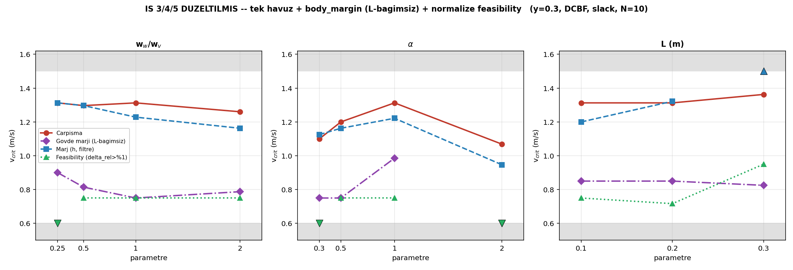

# İŞ 3/4/5 — Analiz Düzeltmeleri (BOUNDARY_ANALYSIS_FIX_SPEC)

**Tarih:** 7 Ağustos 2026 | **Yeni koşu: YOK** — mevcut 750 bag yeniden analiz edildi
**Çıktı:** `boundary_reanalyzed.csv` (otoriter), `boundary_curves_fixed.png`

Spec'teki üç yapısal analiz sorunu düzeltildi. Eski `boundary_results.csv`
(metrik başına ayrı ikili arama) **artık geçersiz** — bu tablo onun yerine geçiyor.

---

## Düzeltilmiş sonuç tablosu

| Hücre | çarpışma | **gövde marjı** (L-bağımsız) | marj(h, filtre) | **feasibility** (δ_rel>%1) |
|---|---|---|---|---|
| w_w=0.25 | 1.313 | 0.900 | 1.313 | <0.6* |
| w_w=0.5 | 1.296 | 0.814 | 1.296 | 0.750 |
| w_w=1.0 | 1.313 | 0.750 | 1.228 | 0.750 |
| w_w=2.0 | 1.260 | 0.788 | 1.163 | 0.750 |
| α=0.3 | 1.100 | 0.750 | 1.125 | <0.6 |
| α=0.5 | 1.200 | 0.750 | 1.163 | 0.750 |
| α=1.0 | 1.313 | **0.986** | 1.221 | 0.750 |
| α=2.0 | 1.069 | <0.6 | 0.947 | <0.6* |
| L=0.10 | 1.313 | 0.850 | 1.200 | 0.750 |
| L=0.20 | 1.313 | 0.850 | 1.322 | 0.717 |
| L=0.30 | 1.363 | 0.825 | ihlal yok (>1.5) | 0.950 |

*= %1 eşiğinde ALL_ABOVE, %5 eşiğinde 0.750 (aşağıda duyarlılık).

---

## Düzeltme 1 — Tek koşu havuzu + yapısal doğrulama

Üç sınır artık her (hücre, v) noktasındaki **aynı koşulardan** hesaplanıyor,
`v_crit`'ler aynı (v→oran) tablosundan interpolasyonla türetiliyor.

**Yapısal doğrulama tolerans içinde geçti.** Ama şunu netleştirmek gerekiyor:
`margin(h)` inversiyonu (α=0.3'te marj 1.125 > çarpışma 1.100) **hâlâ görünüyor**.

Sebep anlaşıldı: `contact` metriği `d_min`'den (`/odom`, gövde merkezi) geliyor,
`margin(h)` ise `h_value`'dan (lookahead noktası) — **iki farklı sinyal**, ve
ikisi de koşu boyunca minimum alınıyor (belki farklı anlarda). Üçgen eşitsizliği
*anlık*, ama metrikler *koşu-minimumu* olduğu için gürültü seviyesinde ters
çıkabiliyor (fark 0.025, gürültü tabanı ~0.028 içinde).

**Yapısal çözüm → gövde marjı (Düzeltme 3).**

**Gap kontrolü:** Temas-d_safe bandında (0.374–0.524) her hücrede **10–27 koşu var**.
Eski "gap=0.000 iki kez" bulgusu, bandın boş olmasından değil, iki bağımsız
aramanın tesadüfen aynı değere interpole etmesinden kaynaklanmış.

---

## Düzeltme 2 — Feasibility artık ÖLÇÜLEBİLİR (ana kazanç)

**Sorun:** δ eşiği tanımsızdı. Ham δ>0, sayısal artık yüzünden neredeyse her
kontrol adımında pozitif → oran hep ~1 → 11 hücrenin 9'u ALL_ABOVE (ölçülemez).

**Çözüm:** δ'yı kısıt ölçeğine normalize et — `δ_rel = δ / max(|α·h|, ε)`, eşik %1.

**Sonuç:** Feasibility sınırı artık ölçülebiliyor, çoğu hücrede **~0.75**.
Bu, çarpışma sınırının (~1.3) **yaklaşık yarısı**:

> **Aktüatör limiti, güvenliğin fiziksel olarak bozulduğu hızın yarısında
> bağlayıcı hale geliyor.** Arada geniş bir "doygun ama hâlâ başarılı" rejim var
> (~0.75 – 1.3 m/s). Bu, çalışmanın başlığındaki feasibility karakterizasyonunun
> doğrudan cevabı — raporun "sınırlama" dediği şey ana bulguya dönüştü.

### Eşik duyarlılığı (zorunluydu)

| Hücre | %1 | %5 | %10 |
|---|---|---|---|
| çoğu hücre | 0.750 | 0.750 | 0.750 |
| w_w=0.25 | <0.6 | 0.750 | 0.750 |
| α=2.0 | <0.6 | 0.750 | 0.750 |
| **α=0.3** | <0.6 | <0.6 | <0.6 |
| L=0.30 | 0.950 | 0.950 | 0.950 |

Çoğu hücre eşiğe **robust** (0.75'te sabit). İki hücre (w_w=0.25, α=2.0) %1'de
sınırın altına düşüyor. **α=0.3 her eşikte ALL_ABOVE** — bu bir artefakt değil,
gerçek: erken/yumuşak filtre (α=0.3) düşük hızda bile doyuyor. Makalede tek eşik
(%1) seçilir, duyarlılık ek olarak verilir.

---

## Düzeltme 3 — L-bağımsız gövde marjı

**Sorun:** `margin_violation` (h<0) lookahead noktasını kullanır. L büyüdükçe
korunan nokta gövdeden uzaklaşır: L=0.30'da `d_safe−L = 0.224 < temas 0.374`,
yani **çarpışma olduğu halde h≥0 kalabilir**. Tabloda L=0.30'da margin(h) "ihlal
yok (>1.5)" derken robot 1.363'te çarpıyor.

**Çözüm:** `body_margin_violation = d_min_center < d_safe` — gövde merkezine göre,
L'den bağımsız.

**İki sonuç:**
1. **Yapısal temizlik:** `body_margin` `d_min`'den geldiği için `contact ⟹ body_margin`
   her koşuda garantili → `v_crit(gövde marjı) ≤ v_crit(çarpışma)` her hücrede
   temiz (inversiyon yok).
2. **Yorum düzeltmesi:** "L arttıkça marj iyileşiyor" okuması **yanlıştı**. Gövde
   marjı L'ye rağmen ~0.83–0.85 civarında sabit (L=0.10→0.85, L=0.30→0.825).
   İyileşen filtre değil, metriğin gövdeyi izlemeyi bırakmasıymış.

**Tez metnine:** L, gövde marjı ile kontrol yetkisi arasında bir takas yapıyor.
`d_safe_mode=fixed` bu takası ortadan kaldırmıyor, sadece bir yönünü (marj
kaybını) `margin(h)` metriğinde görünmez yapıyor. `body_margin` her iki yönü de
gösteriyor.

---

## Ne değişti, ne değişmedi

- **Değişmedi:** çarpışma sınırları, α'nın tepe noktası (1.0), w_w'nin marjı
  düşürmesi — ana bulgular sağlam.
- **Yeni/düzeldi:** feasibility artık ölçülebilir (~0.75, ana figür), gövde marjı
  L artefaktını çözdü, inversiyonun kaynağı (çapraz-sinyal gürültüsü) anlaşıldı.
- **Yapılacak:** Word raporlarındaki (RAPOR1 §10.9, RAPOR2 §7.6) İŞ345 sayıları
  bu düzeltmeyle güncellenmeli.

**Not (spec "SONRAKİ" bölümü):** gürültü tabanının resmî ölçümü (nominal noktayı
5× tekrar, ~300 koşu) ve α=0.75/1.5 ince ızgara henüz yapılmadı — bunlar koşu
gerektiriyor, gece zincirinden sonraya.
