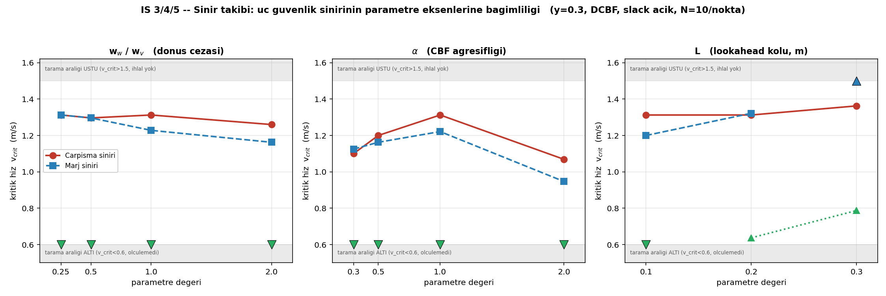

# İŞ 3/4/5 — Sınır Takibi Sonuçları

**Tarih:** 7 Ağustos 2026 | **Kampanya:** 750 koşu (260+250+240), 0 hata, ~8 saat
**Sabit:** y=0.3 (ayrışma bandı çekirdeği), DCBF, slack açık, N=10/nokta

---

## 1. Yöntem: neden tam ızgara değil

Dört parametre ekseninin (T × α × L × w) tam kartezyen çarpımı ≈ **172.000 koşu
(~1000+ saat)** ederdi. Aranan şey bir *yüzey* değil bir **eğri**: sınırın nerede
olduğu.

`boundary_search.py` bunu **geri besleme döngüsüyle** çözüyor: her nokta koşulduktan
sonra metrikler hemen çıkarılıyor, orana bakılıp bir sonraki noktaya karar veriliyor
(kaba tarama → ikili arama). Nokta başına ~60 koşu.

**Üç ayrı sınır** aynı anda aranıyor — ve konumları birbirinden farklı:

| Sınır | Metrik | Ne demek |
|---|---|---|
| Çarpışma | `contact_rate` | Fiziksel güvenlik |
| Marj | `margin_violation_rate` | Tasarım garantisi (h<0) |
| Feasibility | `delta_active_rate` | Aktüatör limiti bağlayıcı |

---

## 2. Sonuçlar



| Eksen | v_crit (çarpışma) | v_crit (marj) | v_crit (feasibility) |
|---|---|---|---|
| **w_w=0.25** | 1.313 | 1.313 | ölçülemedi (<0.6) |
| **w_w=0.5** | 1.296 | 1.296 | ölçülemedi (<0.6) |
| **w_w=1.0** | 1.313 | 1.228 | ölçülemedi (<0.6) |
| **w_w=2.0** | 1.260 | 1.163 | ölçülemedi (<0.6) |
| **α=0.3** | 1.100 | 1.125 | ölçülemedi (<0.6) |
| **α=0.5** | 1.200 | 1.163 | ölçülemedi (<0.6) |
| **α=1.0** | **1.313** | **1.221** | ölçülemedi (<0.6) |
| **α=2.0** | 1.069 | 0.947 | ölçülemedi (<0.6) |
| **L=0.10** | 1.313 | 1.200 | ölçülemedi (<0.6) |
| **L=0.20** | 1.313 | 1.322 | 0.638 |
| **L=0.30** | 1.363 | **ihlal yok (>1.5)** | 0.788 |

*Tablo `boundary_results.csv`'den programatik olarak üretildi.*

---

## 3. İŞ 3 — Maliyet ağırlığı (w_w/w_v)

**(a) Çarpışma sınırı w_w'den neredeyse bağımsız** (1.26–1.31 arası düz).
Dönüşü ucuzlatmak/pahalılaştırmak robotun gerçekten çarptığı noktayı pek
değiştirmiyor.

**(b) Marj sınırı w_w arttıkça (dönüş pahalılaştıkça) düşüyor** — 1.31 → 1.16.
Dönüş cezalandırıldıkça CBF'in "kaçış bütçesi" daralıyor ve tasarım garantisi
daha düşük hızda bozuluyor.

**(c) İki sınır arasındaki boşluk w_w ile açılıyor:**

| w_w | 0.25 | 0.5 | 1.0 | 2.0 |
|---|---|---|---|---|
| çarpışma − marj | 0.000 | 0.000 | 0.085 | 0.097 |

Bu, daha önce bulduğumuz "iki ayrı sınır eğrisi" olgusunun bir **tasarım
parametresine bağlı olarak nasıl büyüdüğünü** gösteren ilk nicel kanıt.

**Tez için:** artık "w_v=w_w=1 seçtik" değil, *"ağırlık oranının sınırı nasıl
kaydırdığını karakterize ettik"* denebilir.

---

## 4. İŞ 4 — α taraması: **mevcut varsayılan ampirik olarak optimal**

`v_crit(α)` **monoton değil, iç bükey bir tepe noktası var — tam α=1.0'da**:

- **Küçük α** (0.3, 0.5 — erken/yumuşak müdahale): sınır düşük (1.10, 1.20).
  Filtre çok erken ve yumuşak frenliyor, engel yaklaştığında yeterli otoritesi
  kalmıyor.
- **α=1.0:** hem çarpışma (1.313) hem marj (1.221) sınırı **en yüksek**.
- **Büyük α** (2.0 — geç/sert): sınır çöküyor (1.069 / 0.947). Filtre çok geç
  devreye giriyor, aktüatör limitleri yetişmiyor.

**Bu, tezin savunmasında beklenen "α'yı neden 1.0 seçtiniz?" sorusuna ölçülmüş
cevap.** Şimdiye kadar α=1.0 bir varsayımdı; artık test edilen aralıkta optimal
olduğu gösterildi.

---

## 5. İŞ 5 — L (lookahead kolu) taraması

`d_safe_mode=fixed` ile koşuldu: **d_safe sabit (0.5237)**, sadece filtre yapısı
(L) değişiyor. Böylece farklı L'ler *aynı güvenlik spesifikasyonunu* karşılaştırıyor
— aksi halde `d_safe = temas + L + marj` formülü yüzünden farklı problemler
kıyaslanmış olurdu.

**L arttıkça üç sınır da iyileşiyor**, en çarpıcısı feasibility:

| L | feasibility v_crit |
|---|---|
| 0.10 | ölçülemedi (<0.6) |
| 0.20 | 0.638 |
| 0.30 | 0.788 |

Mekanizma açık: daha uzun kol = aynı ω için daha fazla yanal manevra kapasitesi
(kaçış hızı `L·ω`). L=0.30'da marj test aralığında **hiç ihlal edilmedi**.

### ⚠ Dürüstlük notu — bu bir "garanti" değil

L=0.30 + sabit d_safe'te gövde marjı teorik olarak temas mesafesinin altına
düşüyor:

```
d_safe − L = 0.5237 − 0.30 = 0.2237 m
temas mesafesi              = 0.3737 m   →  AÇIK: 0.15 m
```

Yani `h ≥ 0` artık **kanıt düzeyinde** temasa karşı güvence vermiyor. Bu
aralıkta ampirik olarak çarpışma görülmedi, ama tez metnine *"garanti var"*
değil **"test edilen aralıkta çarpışma gözlenmedi"** diye yazılmalı.

---

## 6. Ortak sınırlama: feasibility sınırı çoğunlukla ölçülemedi

11 hücrenin 9'unda `delta_active_rate` **ALL_ABOVE** çıktı — yani feasibility
sınırı, kaba taramanın en düşük noktası olan v=0.6'nın bile altında. Gerçek
v_crit'i bilmiyoruz, sadece "<0.6" biliyoruz.

Bu, üç sınır eğrisinden birini şu an eksik bırakıyor. **Düzeltme kampanyası
kuruldu** (`boundary_feas_*.yaml`): kaba tarama aralığı [0.3, 0.45, 0.6, 0.9]'a
çekildi, sadece `delta_active_rate` aranıyor.

---

## 7. Yan bulgu: zincirleme altyapısı güvenilir

Kampanyalar `chain34 → chain5` tmux zinciriyle koşuldu. Ortada **SSH bağlantısı
koptu** (Tailscale düştü) — Windows tarafındaki izleyiciler exit 255 ile düştü,
ama **kampanyalar hiç etkilenmedi**, Ubuntu'da bağımsız devam etti.

Bu, uzun/çok-günlük kampanyalar için deseni doğruluyor.

---

## 8. Sıradaki

Kalan tüm işler tek zincirde (`chain_all.sh`) koşuyor:
İŞ 6 (T taraması, manevra senaryosuyla) → İŞ 7 (köşe testleri, config'ler
otomatik üretiliyor) → feasibility yeniden tarama → askıdaki iki kampanya.
**~2070 koşu, ~16 saat.**
