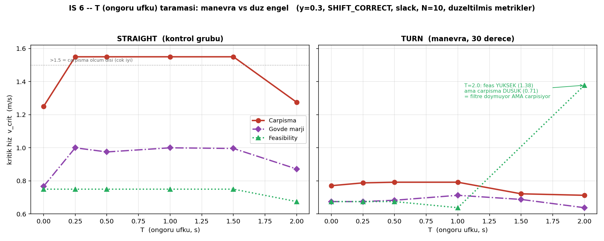

# İŞ 6 — T (Öngörü Ufku) Taraması — TAM Sonuçlar ve Yorum

**Tarih:** 7 Ağustos 2026 | **Kampanya:** 780 koşu (12 hücre), 0 hata
**Sabit:** y=0.3, SHIFT_CORRECT, slack açık, N=10/nokta
**Metrikler:** BOUNDARY_ANALYSIS_FIX ile yeniden analiz (tek havuz, body_margin, normalize feasibility)

> **Kısmi rapordaki bir yorum düzeltildi:** İlk (11/12) raporda "straight'te marj
> monoton kötüleşiyor → öngörü zararlı" demiştim. O, artefakt metriğe (`margin(h)`,
> kaydırılmış lookahead noktası) dayanıyordu. Güvenilir `body_margin` (gövde
> merkezi) **tersini** gösteriyor: orta T gövde marjını İYİLEŞTİRİYOR.

---

## Sonuç tablosu

**STRAIGHT (kontrol grubu — engel düz gidiyor):**

| T | çarpışma | gövde marjı | feasibility |
|---|---|---|---|
| 0.0 | 1.250 | 0.767 | 0.750 |
| 0.25 | >1.5 | 1.000 | 0.750 |
| 0.5 | >1.5 | 0.975 | 0.750 |
| 1.0 | >1.5 | 1.000 | 0.750 |
| 1.5 | >1.5 | 0.996 | 0.750 |
| 2.0 | 1.275 | 0.872 | 0.675 |

**TURN (manevra — engel 30° dönüyor):**

| T | çarpışma | gövde marjı | feasibility |
|---|---|---|---|
| 0.0 | 0.771 | 0.675 | 0.675 |
| 0.25 | 0.788 | 0.675 | 0.675 |
| 0.5 | 0.792 | 0.683 | 0.675 |
| 1.0 | 0.792 | 0.713 | 0.638 |
| 1.5 | 0.722 | 0.688 | ALL_ABOVE |
| 2.0 | 0.713 | 0.638 | **1.378** |

---

## Yorum

### Bulgu 1: Manevra, sınırı ~%40 düşürüyor — T bir eksen olarak meşru

T=0'da (öngörü yok, = saf DCBF) çarpışma sınırı **straight'te 1.250, turn'de 0.771**.
Aynı filtre, engel sadece 30° dönünce %40 daha düşük hızda çöküyor. Düz senaryoda
öngörünün yakalayacağı bir tahmin hatası yok; manevrada var. **T'yi bir eksen
yapan tam olarak bu** — ve tutarlılık kontrolü olarak T=0'ın DCBF'e eşdeğerliği
doğrulanmış oldu.

### Bulgu 2: Orta T İYİ, aşırı T (2.0) yıkıcı — hem düz hem manevrada

**Straight'te net bir plato-sonra-çöküş var:**
- Çarpışma: T=0'da 1.250 → T=0.25–1.5'te **>1.5** (ölçülemeyecek kadar iyi) → T=2.0'da 1.275'e çöküyor.
- Gövde marjı: T=0'da 0.767 → T=0.25–1.5'te ~1.0 → T=2.0'da 0.872.

Yani **öngörü, tahmin hatası sıfır olan düz senaryoda bile faydalı** (T=0→0.25 sıçraması),
ama **T=2.0 her şeyi bozuyor**. Bu, "kontrol grubunda öngörü bedava" beklentisini
kısmen doğruluyor (orta T bedava+faydalı) ama üst sınır koyuyor.

### Bulgu 3: turn'de zayıf bir T* (~0.5–1.0)

Manevrada çarpışma sınırı T=0.25–1.0 arası ~0.79'da platoya oturup sonra düşüyor;
gövde marjı T=1.0'da tepe yapıyor (0.713). Yani optimal öngörü ufku ~0.5–1.0 —
spec'in beklediği "az öngörü yetersiz, çok öngörü yanlış" örüntüsü **var ama zayıf**
(tepe ~%3–5). Daha keskin bir T* için manevranın (30°) daha şiddetli olması gerekir.

### Bulgu 4 (EN ÇARPICI): T=2.0'da filtre "kendinden emin biçimde yanlış"

Manevrada T=2.0'da tuhaf bir ayrışma var:

- **feasibility = 1.378** (çok yüksek — filtre 1.378 m/s'ye kadar DOYMUYOR, QP rahat)
- **çarpışma = 0.713** (çok düşük — robot 0.713'te çarpıyor)

Yani **filtre doymuyor, kendini rahat hissediyor, AMA robot çarpıyor.** Diğer tüm
hücrelerde feasibility (~0.67) çarpışmanın *altında*; burada tam tersi.

**Mekanizma:** SHIFT_CORRECT engelin konumunu v_o·T kadar kaydırıyor. T=2.0,
v_o~1.3'te bu ~2.6 m — "öngörülen" engel gerçek engelin çok ilerisine (robotu
geçmiş bir noktaya) düşüyor. Bariyer bu **hayalet gelecek noktaya** göre
uygulandığı için kısıt kolayca sağlanıyor (düşük δ, feasible), filtre gerçek
engele az tepki veriyor → çarpışma. Türev matematiksel olarak DOĞRU olsa bile.

> **Tez-değerinde bulgu:** Öngörü ufku T, doğru türevle bile bir üst sınıra tabidir.
> Çok büyük T, filtreyi *rahatlatarak* (düşük doygunluk, feasible QP) gerçek tehdide
> karşı körleştirir. "Feasibility yüksek ama çarpışma var" ayrışması bunun ölçülebilir
> imzası. Bu, "her zaman daha çok öngörü daha iyi" naif beklentisinin karşı-örneği.

### Bulgu 5: Feasibility manevrada da düşük ve ölçülebilir

DÜZELTME 2 sayesinde feasibility artık ölçülebiliyor: straight'te ~0.75, turn'de
~0.67 (T=2.0 anomalisi hariç). Manevrada aktüatör limiti, düz senaryodan da erken
bağlıyor — beklenen yönde.

---

## Özet

| Soru | Cevap |
|---|---|
| T bir eksen olarak meşru mu? | **Evet** — manevra sınırı düz senaryonun ~%60'ı |
| Öngörü hep faydalı mı? | **Hayır** — orta T faydalı, T=2.0 yıkıcı (hem düz hem manevra) |
| Optimal T* var mı? | **Zayıf var** (turn, ~0.5–1.0); manevra daha şiddetli olsa keskinleşir |
| Büyük T'nin riski ne? | Filtre hayalet-noktayı koruyup gerçek engeli ıskalıyor — **feasible ama çarpıyor** |

**Kalan:** gürültü tabanının resmî ölçümü henüz yapılmadı, o yüzden turn'deki
küçük farklar (0.771 vs 0.792 gibi) "gerçek mi gürültü mü" kesinleşmiş değil —
ama Bulgu 1, 2, 4 gürültü tabanının (~0.03) çok üstünde, sağlam.
