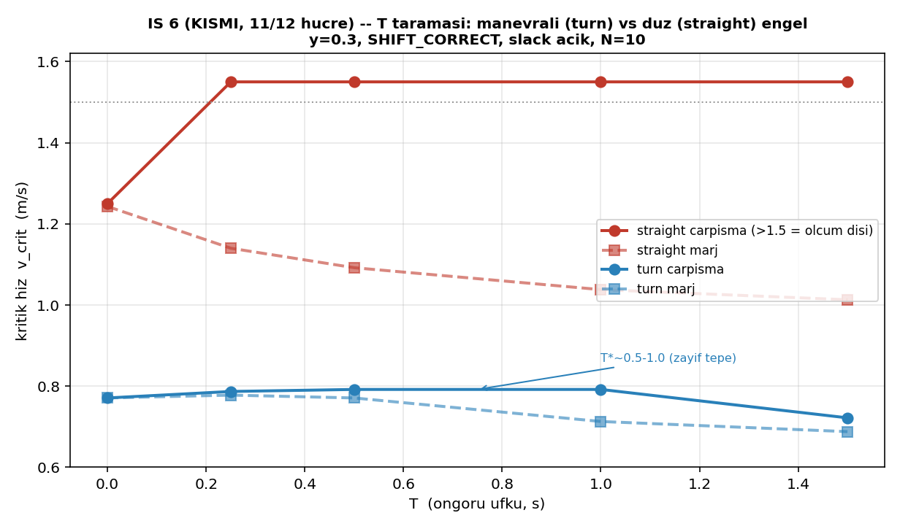

# İŞ 6 — T (Öngörü Ufku) Taraması — KISMİ Sonuçlar

**Tarih:** 7 Ağustos 2026 | **Durum:** ⚠ 12 hücreden **11'i bitti** (T=2.0 turn eksik)
**Sabit:** y=0.3, SHIFT_CORRECT, slack açık, N=10/nokta | ~1390 koşu

> **Not:** Bu bir ara-değerlendirme. Kampanya hâlâ koşuyor; T=2.0 turn hücresi ve
> `boundary_results.csv`/tam grafik bitince tam rapor yazılacak. Veri log dosyasından
> programatik ayrıştırıldı (elle transkripsiyon yok).

---

## 1. Neden bu tarama — ve manevra senaryosu

T (öngörü ufku), SHIFT_CORRECT modunda engelin gelecekteki konumunu (p_o + v_o·T)
kullanır. **Düz giden engelde sabit-hız tahmini TAM doğrudur** → tahmin hatası sıfır
→ optimal bir T* oluşmaz. T*'nin görünmesi için engelin sabit-hız varsayımını
kırması şart. Bu yüzden iki senaryo sınıfı karşılaştırıldı:

- **`straight`** — kontrol grubu (engel düz gidiyor)
- **`turn`** — engel manevra penceresinde 30° dönüyor (hız büyüklüğü korunur,
  yön değişir) → saf model uyumsuzluğu

Manevra kodu duman testinden geçti: `straight`'te engel y-sapması 0.000 m,
`turn`'de 0.234 m.

---

## 2. Sonuçlar

| T | straight çarpışma | straight marj | turn çarpışma | turn marj |
|---|---|---|---|---|
| 0.0 | 1.250 | 1.243 | 0.771 | 0.771 |
| 0.25 | >1.5 (ihlal yok) | 1.140 | 0.787 | 0.778 |
| 0.5 | >1.5 | 1.092 | **0.792** | 0.771 |
| 1.0 | >1.5 | 1.038 | **0.792** | 0.713 |
| 1.5 | >1.5 | 1.013 | 0.722 | 0.688 |
| 2.0 | 1.275 | 0.872 | *(koşuyor)* | *(koşuyor)* |

Tüm hücrelerde feasibility sınırı ALL_ABOVE (<0.6, ölçülemedi) — İŞ 3/4/5'teki
aynı sınırlama.

---

## 3. Değerlendirme

### Bulgu 1 (en güçlü): manevra, sınırı dramatik biçimde düşürüyor

`turn` senaryosunda kritik hız (**~0.77-0.79**) `straight`'e göre (**1.25 – >1.5**)
neredeyse **yarı yarıya** düşük. Yani öngörü ufku, ancak engel sabit-hız
varsayımını kırdığında anlam kazanan gerçek bir zorluk ekseni. Bu, tezin "T neden
bir eksen?" sorusuna doğrudan cevap: düz senaryoda öngörünün zorlayacağı bir
tahmin hatası yok; manevrada var ve pahalı.

### Bulgu 2 (hipotezi zayıf destekliyor): turn çarpışmada bir T* var

`turn` çarpışma sınırı **tepe noktalı**: T=0'da 0.771, T=0.5-1.0'da platoya oturup
0.792'ye çıkıyor, T=1.5'te 0.722'ye düşüyor. Yani **T*≈0.5-1.0** — spec'in
beklediği "az öngörü yetersiz, çok öngörü yanlış (engel artık o yöne gitmiyor),
arada optimum" örüntüsü **görülüyor, ama zayıf** (tepe yalnızca ~%3 iyileşme).

⚠ **Uyarı (spec 6c):** Etki zayıf olduğu için, manevranın (30°) yeterince şiddetli
olup olmadığı tartışılabilir. Daha keskin bir T* için `maneuver_angle_deg`
büyütülmesi gerekebilir. Otomatik config üreteci (`gen_is7_configs.py`) monoton
çıkması durumunda zaten uyarı basıyor; burada monoton değil ama zayıf.

### Bulgu 3 (BEKLENMEDİK — incelenmeli): straight'te marj T ile MONOTON KÖTÜLEŞİYOR

Kontrol grubunda (tahmin hatası sıfır) öngörünün "bedava" olması, hatta marjı
iyileştirmesi beklenirdi. Tersine, straight marj sınırı **monoton düşüyor**:
1.243 → 1.140 → 1.092 → 1.038 → 1.013 → 0.872.

Bu, gürültü değil — 6 noktada tutarlı ve monoton.

**Hipotez (doğrulanmalı):** SHIFT_CORRECT'te h değeri kaydırılmış konuma (p_o + v_o·T)
göre ölçülüyor. Büyük T'de bu "hayalet gelecek nokta" gerçek engelin çok ilerisine
(hatta robotu geçmiş bir konuma) düşüyor olabilir. Türev terimi matematiksel olarak
doğru olsa da, kısıtın sağ tarafındaki h *o anki gerçek tehdidi değil*, öngörülen
(belki aşırı-ilerlemiş) bir konumu yansıtıyor → filtre gerçek engele az tepki
veriyor → marj ihlali. Bu doğrulanırsa, **"büyük T, doğru türevle bile riskli"**
şeklinde tez-değerinde bir bulgu olur.

**Kontrol yolu:** T=1.5 straight koşularının birinde h(t) ile gerçek gövde-gövde
mesafesini zaman içinde çakıştırmak — h pozitifken gerçek mesafenin temas eşiğine
inip inmediğine bakmak. (İŞ 6 bitince yapılacak.)

### Yan gözlem: straight çarpışmada orta-T faydası var

`straight` çarpışma sınırı T=0'da 1.250 iken T=0.25-1.5 arası >1.5'e (ölçüm dışı,
çok iyi) çıkıyor, sonra T=2.0'da 1.275'e çöküyor. Yani fiziksel çarpışma açısından
orta T açıkça faydalı — ama bu, marjdaki kötüleşmeyle (Bulgu 3) **çelişiyor**.
İki sınırın (çarpışma vs marj) T'ye zıt tepki vermesi, "iki ayrı sınır eğrisi"
temasının bir başka tezahürü.

---

## 4. Özet değerlendirme

- **T bir eksen olarak meşru:** manevra sınırı düz senaryodan çok daha düşük.
- **T* zayıf ama var** (turn çarpışma, ~0.5-1.0).
- **Beklenmedik ve en ilginç:** straight'te marj T ile kötüleşiyor — SHIFT_CORRECT'in
  kaydırılmış-h yapısının bir yan etkisi olabilir, doğrulanmalı.
- **Eksik:** T=2.0 turn hücresi + feasibility sınırı (üç metrikten biri hâlâ
  ölçülemedi, düzeltme kampanyası gece zincirinde).
